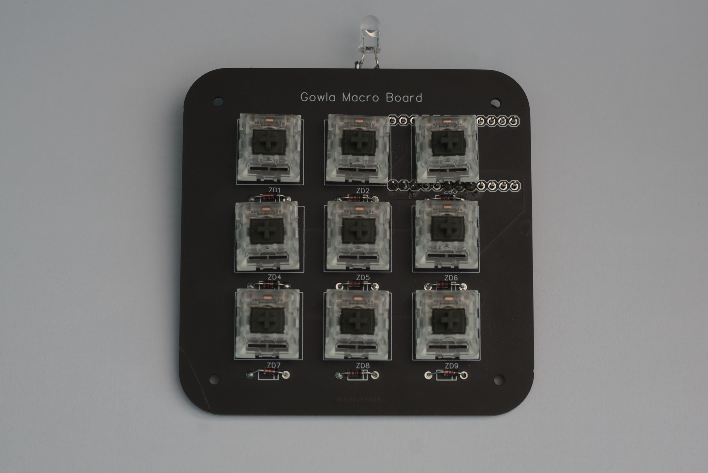
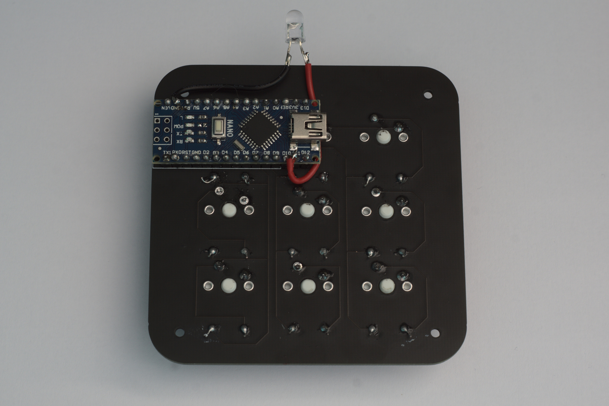

# IR-Remote-Nano: Arduino Nano + IR Remote
---

## Why

Shows that the board is compatible with an Arduino Nano - the overhanging pins need to be snapped off but it works if you don't require the USB host functionality for some reason.

I use it to control an iPod dock on my desk, as its nicer to use than the original remote, which was blu-tacked to the desk.

## Images

<table>
  <tr>
    <td>
      
    </td>
    <td>
      
    </td>
  </tr>
</table>
  
## Code
1. [Basic IR Control with IRMP](basicir.ino)

## Maintainer

* [dan-r](https://github.com/dan-r)
